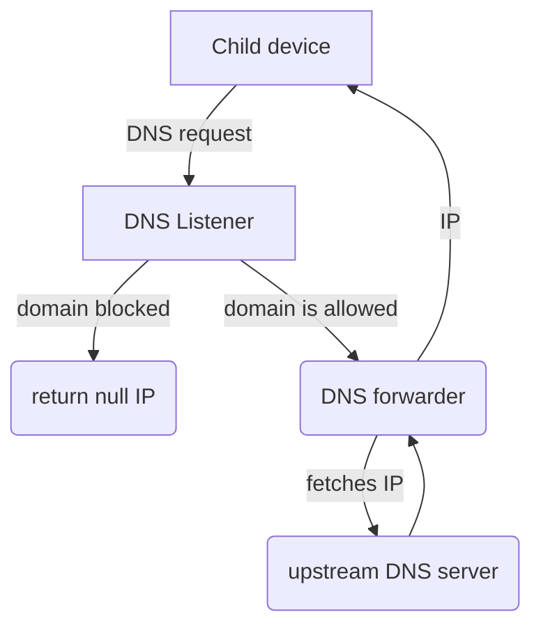
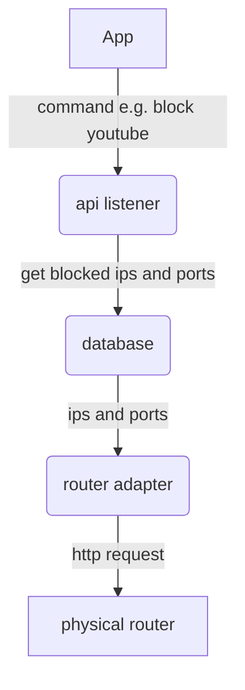

DNS filtering


Simple stack


Testing router adapters
```mermaid
sequenceDiagram
    test class->>+Router adapter: Settings to change
    Router adapter->>+Router: http request
    Router-->>-Router adapter: response

    test class->>+Router adapter: Settings to check
    Router adapter->>+Router: http request
    Router-->>-Router adapter: response
``

Inegration testing - whole backend
```mermaid
sequenceDiagram
    supertest ->> api listener: call endpoint 
    api listener->>+database: Settings to change
    database->>+Mock router adapter: http request

    api listener->>+Mock router adapter: Settings to check
```

TODO - remove as many imports from as many classes, undo statics
